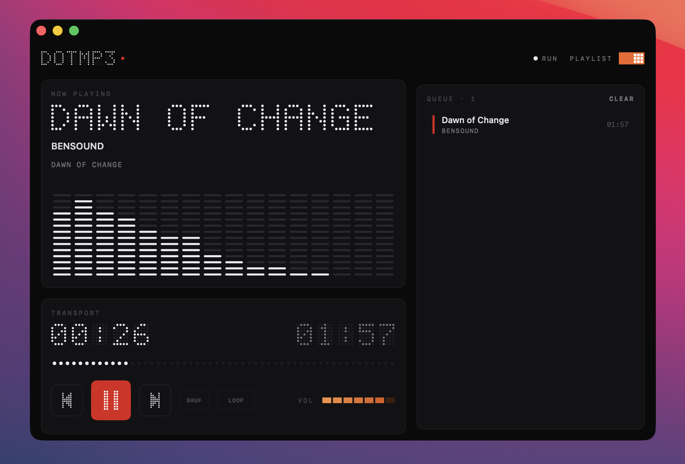

<div align="center">


# DotMP3

**A native macOS MP3 player with a dot-matrix, instrument-panel aesthetic.**

Pure-black bento panels, a hand-built 5×7 dot-matrix font, an FFT spectrum, and a single
splash of red — built entirely in SwiftUI.

</div>

<div align="center">



</div>

## Features

- **Dot-matrix display** — a custom 5×7 dot font renders the wordmark, the now-playing
  title (with marquee scrolling for long names), and the big transport time readout.
- **Live FFT spectrum** — `AVAudioEngine` + `vDSP` drive a 16-band, pixel-style analyzer
  with a spectral tilt so the bars stay balanced across the range.
- **Full transport** — play/pause, prev/next, a dotted scrubber, and a dotted volume strip,
  all with "slam-and-settle" press animations.
- **Shuffle & repeat** — `SHUF`, `LOOP` (repeat-all), and `LOOP·1` (repeat-one).
- **Queue management**
  - Drag & drop audio files from Finder anywhere in the window.
  - Drag rows to reorder (with an orange drop indicator).
  - Single-click to select, double-click to play.
  - Right-click → **Remove from Queue**, or **CLEAR** the whole list.
- **Pixel toggle switch** — slide the queue panel in and out.
- **Persistent library** — your queue, the selected track, and volume are restored on the
  next launch via security-scoped bookmarks (sandbox-safe).
- **Metadata & artwork** read via `AVAsset`.

## Design

DotMP3 follows the "Nothing" design language: a near-black panel, off-white lit dots over
faint ghost dots, `Space Mono` / `Space Grotesk` typography (with monospaced fallbacks),
a 16px bento grid, and the brand red used **exactly once** — the blinking status dot that
pulses while audio is playing.

## Requirements

- macOS 14.0+
- Xcode 16+ (Swift 5)
- [XcodeGen](https://github.com/yonatankra/xcodegen) (`brew install xcodegen`) to generate
  the project

## Build & run

```bash
xcodegen generate
open DotMP3.xcodeproj   # then ⌘R in Xcode
```

Or from the command line:

```bash
xcodegen generate
xcodebuild -project DotMP3.xcodeproj -scheme DotMP3 -configuration Debug build
```

## Usage

- **Add music** — drag audio files into the window, or use **File → Open Files…** (⌘O).
- Supported formats: MP3, M4A, AAC, WAV, AIFF, FLAC.
- The demo screenshot uses *Dawn of Change* by [Bensound](https://www.bensound.com).

## License

MIT
